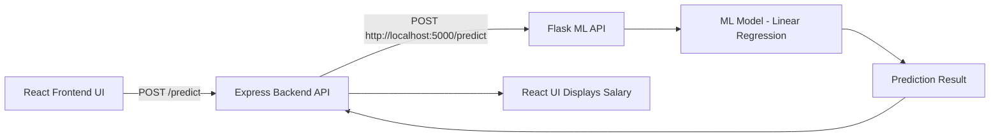

```
salary-predictor
│
├── Backend              # Express API server
│   └── server.js
│
├── Frontend             # React UI
│   └── SalaryPredictor.jsx
│
├── ML                   # Machine Learning service
│   └── ml_api.py
│
└── README.md
```



