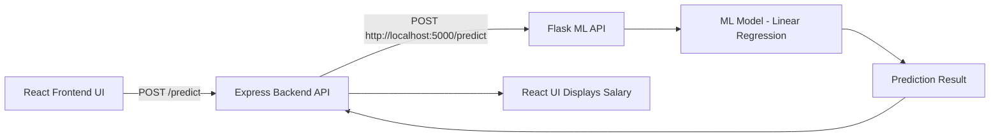

```
salary-predictor
│
├── Backend
│   ├── server.js
│   ├── package.json
│   └── node_modules
│
├── Frontend
│   ├── src
│   │   ├── App.jsx
│   │   ├── main.jsx
│   │   └── assets
│   │
│   ├── Component
│   │   └── SalaryPredictor.jsx
│   │
│   ├── public
│   ├── package.json
│   └── vite.config.js
│
├── ML
│   ├── ml_api.py
│   └── requirements.txt
│
├── .gitignore
└── README.md
```



